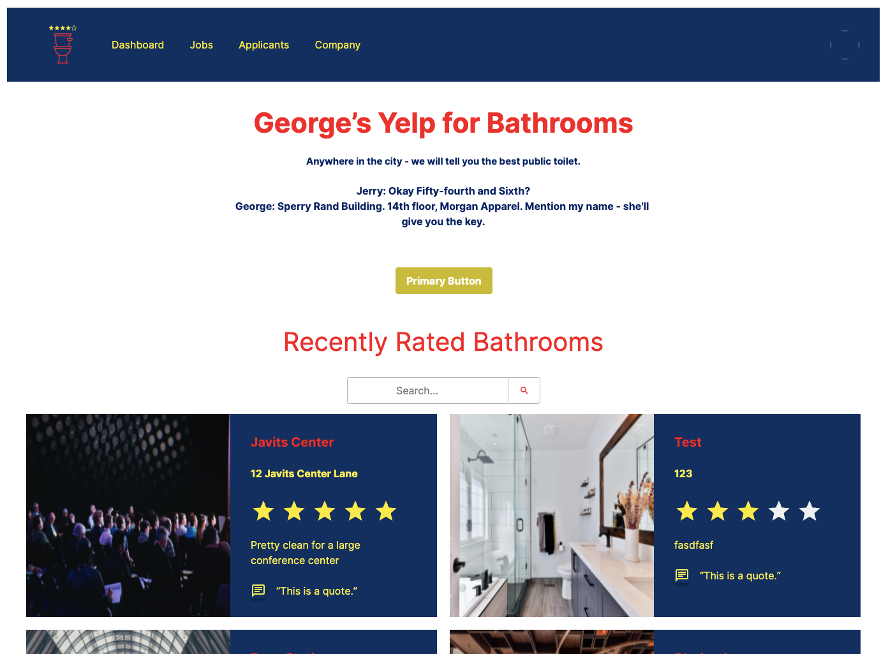
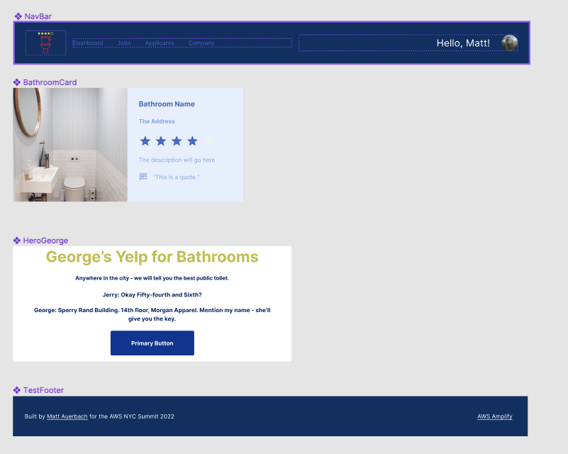

# Amplify Studio Tutorial 

Build a mini Yelp for Bathrooms. This was my demo for the AWS NYC Summit talk. 

It's inspired by Seinfeld and the [scene where George Costanza](https://www.youtube.com/watch?v=JYVBRQ7t46g) says "give me an address, ill tell you the best bathroom in the city." 



View the running demo here [https://main.d2ddguywmojniz.amplifyapp.com/](https://main.d2ddguywmojniz.amplifyapp.com/)

## What is Amplify Studio?

[Amplify Studio](https://aws.amazon.com/amplify/studio/) is a new service apart of the Amplify portfolio -- it helps frontend developers more easily build UIs by converting Figma files to human-readable react code! You don't have to be a CSS wiz! 

# Building the App

Step-by-step on how to configure, develop & deploy this app on AWS.

## Housekeeping

### Studio Setup

Studio will orchestrate handling your data APIs, generating your React code from Figma and more, like authentication! 

1. Sign-in to AWS or [Create an Account](https://us-west-2.console.aws.amazon.com)
2. Head over to AWS Amplify, New app -> Build an app. Give it a name, deploy. 
3. Launch Studio! FYI, you can grant co-workers access to studio without requiring an AWS account.
4. Let's add our data models. Use the suggested model below called `Bathrooms`

```
name -> String
rating -> Float
address -> String
description -> String
image_url -> String 
```
5. Save, and deploy. 

### Figma Setup 

I recommend starting with our [base Figma template](https://www.figma.com/community/file/1047600760128127424) and altering/building components from there. These privatives are tied to [Amplify UI library](https://ui.docs.amplify.aws/).

1. For this tutorial, you can use my [Figma File](https://www.figma.com/file/OKViErrJvjjAgTqNCD4azZ/AWS-NYC-Summit-2022?node-id=861%3A3635) where I've configured 4 components to match the above design. Duplicate this in your Figma account.

The components are called:

```
NavBar
BathroomCard
HeroGeorge
TestFooter
```
2. Play around with the file, and create or alter a component of your own! We will use shortly.



## Local Dev Setup

1. Create a base React app to give us a starting point. 
2. I used CRA - `npx npx create-react-app .`
3. `npm install` & `npm start` - confirm this works as expected
4. Install Amplify CLI (Amplify's toolchain) `npm install -g @aws-amplify/cli`
5. Install Amplify's UI lib `npm install aws-amplify @aws-amplify/ui-react`
6. Initialize Amplify with `amplify init` , follow steps 

## Seed Data 

Amplify Studio also provides a light-weight CMS. This makes it easy to test and prototype. 

1. In Amplfiy Studio, click Content (under manage). 
2. You can try to auto-generate data using the Faker.js integration, but I recommend making three entries of your own. If you need an image, you can use these: [image1](https://images.unsplash.com/photo-1518373714866-3f1478910cc0?ixlib=rb-1.2.1&ixid=MnwxMjA3fDB8MHxwaG90by1wYWdlfHx8fGVufDB8fHx8&auto=format&fit=crop&w=2670&q=80) , [image2](https://images.unsplash.com/photo-1518373714866-3f1478910cc0?ixlib=rb-1.2.1&ixid=MnwxMjA3fDB8MHxwaG90by1wYWdlfHx8fGVufDB8fHx8&auto=format&fit=crop&w=2670&q=80) , [image3](https://images.unsplash.com/photo-1623593419606-7f9c8c22d736?ixlib=rb-1.2.1&ixid=MnwxMjA3fDB8MHxwaG90by1wYWdlfHx8fGVufDB8fHx8&auto=format&fit=crop&w=2670&q=80) 
3. Click create bathroom, and create a few! This data updates in real-time!

## Building the UI

After your components are built (yes, they can be adjusted at anytime) let's sync them with Amplify studio

1. Go to Amplify Studio. Click UI Library -> get started.
2. Copy/Paste your Figma URL
3. Studio is now importing each component -- feel free to Accept all.
4. Moving forward, each adjustment made to the Figma file will need to be synced to Studio. (see workflow section below)
5. After Studio imports these components, we must bind the corresponding fields to the data model we created.
6. Let's sync `BathroomCard` first. Find it from the component list, then click Configure (upper right)
7. Click on Bathroom Name -> set text label. Under value select bathroom.name. 
8. Set the remaining properties (don't forget the image). The [rating component](https://ui.docs.amplify.aws/react/components/rating) requires you to create a prop called `value`, then for Value select `bathroom.rating`. 
9. Now our bathroom component is linked to our data models. This will generate code that pulls live data using the APIs created & managed by Studio. 
10. Let's build a Collection which will display a list of our `BathroomCard`. Click Create collection and name it `BathroomCardCollection`. Test different layouts. I selected Grid. You can also sort and add pagination or search with a click.
11. Configure the remaining components using the methods above. [Here's the logo](https://github.com/mauerbac/amplify-studio-yelp-bathroom/blob/main/bathroom_logo_sm.png) I used for the Header. Set this in Amplify Studio by setting the src prop.

## Generating React code from Studio

Now that our components are built, synced and linked to data in Studio, we can now import them in our codebase. 

1. In studio, click Get component code at the bottom. 
2. First, we must pull down these changes by running `amplify pull`, the full command should look like `amplify pull --appId xxxapp_id``` --envName staging
3. This pulls the human-readable code locally. You can view the component code in the [Components directory](https://github.com/mauerbac/amplify-studio-yelp-bathroom/tree/main/src/ui-components)
4. In general, you simply import the component like this
```
import { 
  BathroomCardCollectionThree 
} from './ui-components';
```
Then call it `<BathroomCardCollectionThree />`

## Putting it together 

1. Copy/paste the [App.js code](https://github.com/mauerbac/amplify-studio-yelp-bathroom/blob/main/src/App.js) - Simply imported & referenced the 4 components and added a few CSS properties. 
2. Copy/paste the [Index.js code](https://github.com/mauerbac/amplify-studio-yelp-bathroom/blob/main/src/index.js) - installed Amplify. 
3. Want the same font? Put `@import url('https://fonts.googleapis.com/css2?family=Inter:slnt,wght@-10..0,100..900&display=swap');` at the top of `App.css`

Run the app! `npm start` 

## Developer Workflow

The optimal developer workflow is 1) Editing components in Figma 2) Syncing these changes to Studio (click Sync with Figma Button) 3) running `amplify pull` locally 

This takes the changes from Figma, imports to Studio, then updates the generated code. 

## Additional Functionality 

1. Use the [Amplify Theming Plugin](https://docs.amplify.aws/console/uibuilder/theming/) 
The Seinfeld colors are...
```
Red: #fe0116
Blue: #062f63
Yellow: #ffea00
```
2. Add Authentication with one click! Click the Authentication tab in Studio. Keep the defaults and click Deploy. Then [uncomment Line 34](https://github.com/mauerbac/amplify-studio-yelp-bathroom/blob/main/src/App.js#L34) in `App.js` , comment out line 35.
3. Check out [overrides](https://docs.amplify.aws/console/uibuilder/override/)
4. Deploy on Amplify Hosting with one command `amplify publish` 

## Need Help?

* Reach out on the [Amplify Discord Server](https://discord.gg/amplify) 
* Tweet at [@mauerbac](https://twitter.com/mauerbac) on Twitter
* Create a GitHub issue in the [Studio Repo](https://github.com/aws-amplify/amplify-adminui/issues)
